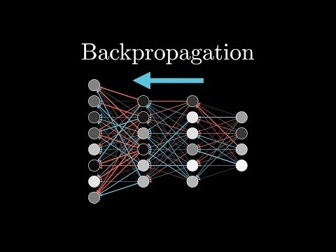

summary: Given our model understands what's right and wrong, how does it improve itself over time?           
type: md
date: 31/8/2024
title: What is "Backpropagation"?
image: ./pages/public/tree-thumbnails/understanding_back_prop.png
difficulty: easy
authors: Ben Paulson
categories: Basics of AI, 3Blue1Brown

## Why Read?
By watching this video below, you'll be able to understand on a deeper level what is truly meant when someone says an AI model is "training". 3Blue1Brown is an excellent educator in the space of AI, and MILLIONS of people recommend getting started with this video -- after watching this third part of four, you'll be able to understand how different labels results in different weights, how these weights are adjusted with calculus to minimize error, and how this ultimately leads to a model that can predict with high accuracy.

 

 

If you would like to better understand the Calculus behind the training and prediction of AI models, meaning you have an interest in the "theory" side of AI models. I would recommend watching the final part of 3Blue1Brown's series, though it is not required:

